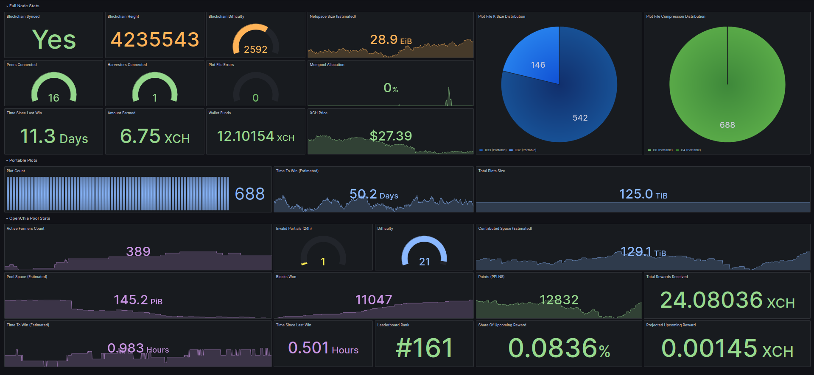

# chiatter
A chia collection agent/Prometheus client that gathers various stats from a local chia node and exposes them to a Prometheus server & Grafana.



## What do I need to do to get it running on my PC?

**❄** You will need a **python3.6+** environment. Most Linux distros will come with python3 installed - make sure you pick one which comes with **python 3.6** or above.

**❄** The following python3 packages need to be installed: `prometheus_client, chia-blockchain` (and dependencies). I leave the details up to you. As long as they're in the PYTHONPATH, chiatter will not complain.

**❄** A full chia node running on the same host. No, it's not possible to run it remotely at this point!

**❄** HTTP port 8080 must be open for business (firewalls included), since the Prometheus server will need to access it in order to scrape and aggregate all the stats.

## If I used the chia CLI installer how do I get chiatter working?

Assuming `~/chia-blockchain` is the folder where you've installed the chia-blockchain, you need to go through the following steps in order to set up chiatter:

**1.** Create a softlink to the `~/chia-blockchain/chia` folder under `~/chiatter/scripts` by running:

```
cd ~/chiatter/scripts
ln -s ~/chia-blockchain/chia chia
```

**2.** Enable the chia python venv:

```
cd ~/chia-blockchain
. ./activate
```

**3.** Install the chiatter dependencies inside the venv:

```
python -m pip install prometheus_client requests
```

And that's it, you can now run chiatter from within the vnev.

## OpenChia? What is that? Do I need it?

[OpenChia](https://openchia.io/) is an open source chia pool, which I can wholeheartedly recommend. That being said, no, you don't necessarily need it and it's disabled in the config file provided with this codebase.

## Ok then, let's say I join OpenChia and want to give it a spin? What then?

Two things:

**❄** Set the following in `chiatter.conf`:

```
modules = chia_stats,openchia_stats
```

**❄** Also replace the following placeholder with your NFT launcher id. You can get the required string either by using the chia CLI or the UI interface.

```
launcher_id = <replace_with_your_launcher_id>
```

You won't have to make any changes whatsoever if you don't plan on joining OpenChia, so just stick to the defaults in that case (boooooo!).

## A Prometheus sever? Grafana? How the heck am I supposed to get those?

It's up to you, really - the simple way is to use docker. Check out my dev "deployment" script in the `misc` folder. It assumes you will want to run the Prometheus server and Grafana containers on the same machine as chiatter - otherwise some tinkering is required in `prometheus.yml` to point it to the host chiatter (and your full chia node) is actually running on. You may also need to adjust `datasources.yml` if you plan on running grafana on a different host than prometheus.

## Charts? Dashboards? Where, how?

I've included a sample dashboard of my very own design. Find the hidden import dashboard option in Grafana and use the provided `.json` file (also under `misc`). Think of it as an NPC given side-quest and figure it out to level up!

## Why "chiatter"?

Because the exchange of information is key to all great things. So, you know, radio chatter... while crunching on some chia seeds.

## Nothing works! What do I do?

Exactly what you'd do in other situations when nothing works. Raise an issue on github and I'll reply as soon as I can.

## Disclaimer

I can not be held responsible for injuries, headaches or curses uttered during the use of this piece of... software. That being said, I welcome constructive suggestions and contributions. Other than that, feel free to use it however you see fit, adapt it, mix it, print the code and tape it to the exterior of an apartment building if that's your thing (why though? perhaps reconsider?).

